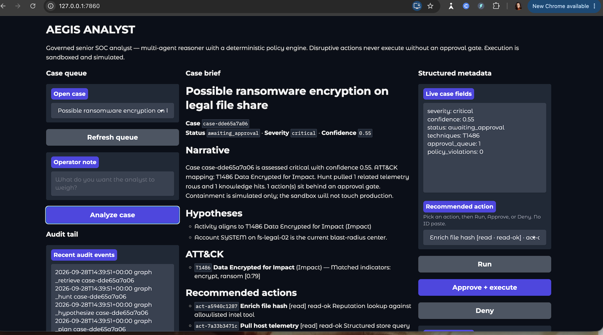
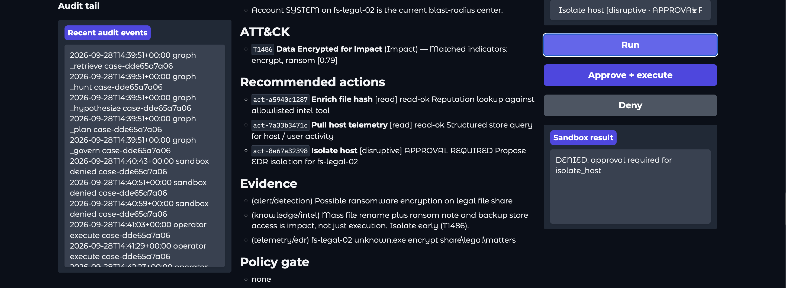
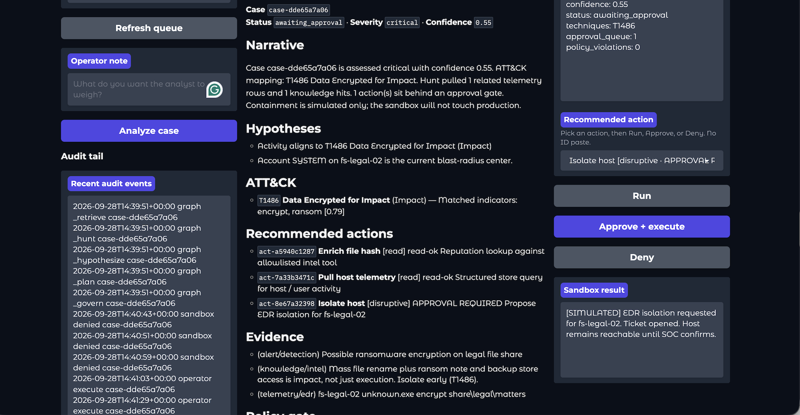
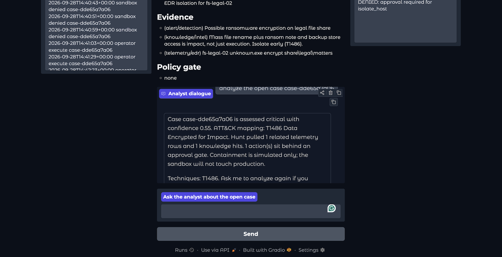

# AEGIS ANALYST

Governed senior SOC analyst agent. Three-panel operator console.

This is not a chatbot on a CVE list. Aegis is a constrained multi-agent system for the part of SOC work that burns juniors: triage, ATT&CK mapping, action planning, and the moment someone almost isolates the wrong host.

**The model may narrate. It does not execute. Policy is code.**

Repo: https://github.com/TAM-DS/aegis-analyst

---

## What you are looking at

A hiring manager can clone this, run it, and attack the containment button in one sitting.

| Panel | Job |
| --- | --- |
| Left | Case queue, operator note, append-only audit tail |
| Center | Case brief + analyst dialogue |
| Right | Severity, confidence, ATT&CK, recommended action, Run / Approve / Deny |

Seeded cases:

- Encoded PowerShell + LSASS dump + beacon (`T1059.001`, `T1003.001`, `T1071.001`)
- Spearphish invoice macro
- VPN password spray
- Legal file-share encryption / ransomware pattern (`T1486`)

---

## Demo (the three beats)

1. **Analyze** a critical ransomware case. Brief maps **T1486**, confidence stays honest (not 0.99), status becomes `awaiting_approval`.
2. Select **Isolate host** → **Run**. Policy + sandbox return **DENIED** unless a human has approved.
3. **Approve + execute**. Sandbox returns:

   `[SIMULATED] EDR isolation requested for fs-legal-02. Ticket opened. Host remains reachable until SOC confirms.`

That last sentence is the product. Isolation was requested. The host was not taken offline.

**Deny** is a third control: `Operator denied. No sandbox call issued.`

The live frames:









---

## Why this exists

SOC queues punish hesitation and reckless containment equally. Most "AI for security" demos hide that tradeoff behind a chat box.

Aegis makes the tradeoff visible:

- **Monster-light (default):** deterministic analyst graph. No API key. Reproducible briefs.
- **Monster-heavy (optional later):** LLM only for narrative polish. Severity, ATT&CK, approval, and sandbox stay deterministic.
- **Governance:** disruptive tools always require an operator gate.
- **Sandbox:** allowlisted simulated actions. No shell, no network, no production side effects.
- **Audit:** every graph node and every execute/deny is appended to `data/audit/events.jsonl`.

Same thesis as `monster-heavy`, `agent-foundry`, and `secure-agent-execution-environment`: capability without a boundary is not a product.

---

## Architecture

```
alert + operator note
        |
        v
   ingest / seed
        |
        v
 retrieve (lexical memory) -> hunt (SQLite telemetry)
        |
        v
 hypothesize (ATT&CK rules) -> plan (actions)
        |
        v
 govern (policy engine) -- veto / force approval
        |
        v
 brief + operator UI
        |
        v
 sandbox execute (only if allowlisted + approved)
        |
        v
 audit log
```

Stores:

- **Structured:** SQLite cases + telemetry (`data/aegis.db`)
- **Lexical memory:** in-process overlap store (intentionally not an embeddings theater)
- **Audit:** append-only JSONL

---

## Run locally (macOS)

```bash
cd aegis-analyst
python3 -m venv .venv
source .venv/bin/activate
pip install -r requirements.txt
python app.py
```

Open http://127.0.0.1:7860

1. Pick a case by **title** in the queue.
2. Click **Analyze case**.
3. Pick a recommended action.
4. **Run** (read tools go through; isolate/block/disable do not).
5. **Approve + execute** or **Deny**.

PyCharm / Cursor: set `.venv` as the interpreter, run `app.py`.

Tests:

```bash
pip install pytest
python -m pytest tests/ -q
```

The tests exist to prove the hiring point: unapproved disruptive actions are denied.

---

## What a reviewer should notice

1. Agents are a named state machine, not a single prompt.
2. Policy is Python, not a system prompt that can be sweet-talked.
3. Tools cannot be invented at runtime. Unknown tools are denied.
4. Execution is simulated **on purpose**. That is the product, not a missing integration.
5. The UI is an operator console, not a chatbot skin.

### Why there is no real EDR hook

Wiring CrowdStrike or SentinelOne would turn a portfolio system into an unowned production control plane. A reviewer cannot safely click Isolate if it might drop a host. Simulation plus the sentence "host remains reachable until SOC confirms" is the honest boundary. Real EDR belongs behind an employer's change-control, not a public GitHub repo.

### Why there is no LangGraph-for-show

The graph is already retrieve, hunt, hypothesize, plan, govern, execute. Adding LangGraph without a new constraint is a dependency flex. Interviewers who have been burned by agent demos look for the gate, the audit, and the deny path — not the brand of the orchestrator.

### Why there is no vector CVE dump

CVE RAG answers "what is this CVE?" Junior fatigue is "should I isolate this host?" Aegis maps telemetry to ATT&CK, plans actions, and refuses to execute containment without a person. Embedding a vulnerability catalog would make this look like every other toy security LLM.

---

## 90-second talk track

Junior analysts freeze or over-contain. Aegis drafts the brief and the action list. Policy stamps disruptive actions as approval-required. The operator can deny with no sandbox call, run a read tool, or approve a simulated isolate. The host stays reachable. That is how you put an agent in a SOC without giving it the building.

---

## Status

**v1 is demo-complete.** Clone, run, analyze, deny, approve.

Do not add real EDR, a decorative graph library, or CVE RAG unless a specific job requires that integration.

Optional later (only if a conversation asks): Grok narrative that cannot skip the gate, per-row action buttons, recruiter one-liner script.

Portfolio system for Tracy Manning / TAM-DS.
